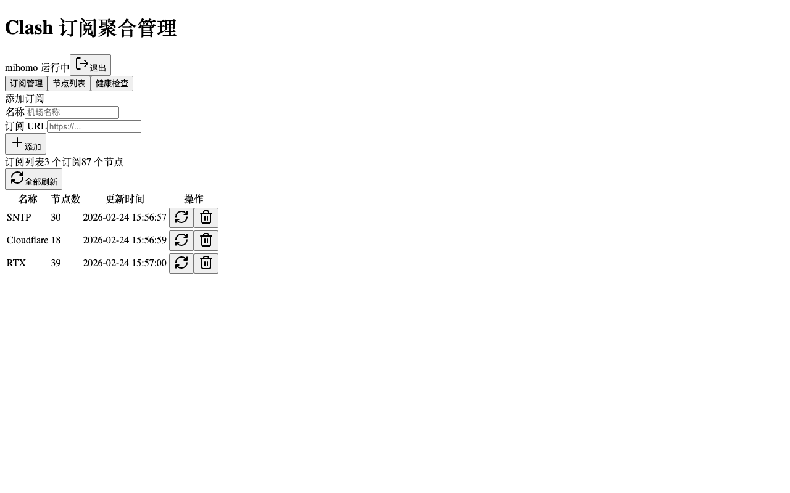
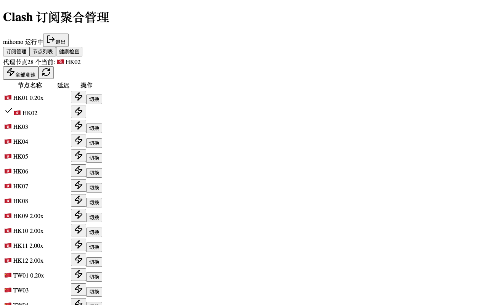
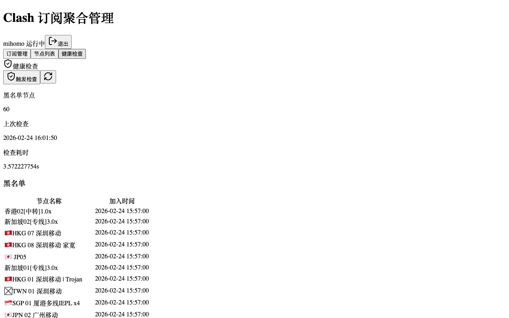

<div align="center">

# 🌐 Clash Subscription Aggregator

### Clash / mihomo Multi-Subscription Proxy Bridge

<p>
  
  
  
  
  
</p>

<p><strong>Merge multiple Clash/mihomo proxy subscriptions into one unified HTTP/SOCKS5 proxy endpoint.<br/>Web dashboard + RESTful API for node management, line switching, and health checking.</strong></p>

<p>将多个 Clash 代理订阅聚合为统一代理入口，提供 Web 管理面板 + REST API，集中管理节点、切换线路、健康检查</p>

<br/>

<table>
<tr>
<td align="center">🔗<br/><strong>多订阅聚合</strong></td>
<td align="center">🖥️<br/><strong>Web 面板</strong></td>
<td align="center">🎯<br/><strong>地区过滤</strong></td>
<td align="center">🔀<br/><strong>API 切换</strong></td>
<td align="center">📡<br/><strong>标准代理</strong></td>
<td align="center">🛡️<br/><strong>Token 认证</strong></td>
<td align="center">🔄<br/><strong>进程守护</strong></td>
<td align="center">💊<br/><strong>健康检查</strong></td>
</tr>
</table>

</div>

---

## 📸 界面预览

<table>
<tr>
<td width="50%">

<p align="center"><strong>Token 登录</strong></p>
</td>
<td width="50%">

<p align="center"><strong>订阅管理</strong></p>
</td>
</tr>
<tr>
<td width="50%">

<p align="center"><strong>节点列表 & 切换</strong></p>
</td>
<td width="50%">

<p align="center"><strong>健康检查</strong></p>
</td>
</tr>
</table>

---

## 工作原理

```
                          ┌──────────────────────────┐
程序/脚本/Proxifier  ───→  │  VPS (代理端口)           │ ───→ 代理节点 ───→ 目标网站
                          │  mihomo 内核              │
浏览器/curl         ───→  │  VPS (Web 面板 + API)     │
                          └──────────────────────────┘
```

---

## 🚀 快速开始

### 1. 安装 mihomo

```bash
wget https://github.com/MetaCubeX/mihomo/releases/download/v1.19.20/mihomo-linux-amd64-v1.19.20.gz
gunzip mihomo-linux-amd64-v1.19.20.gz
chmod +x mihomo-linux-amd64-v1.19.20
mv mihomo-linux-amd64-v1.19.20 /usr/local/bin/mihomo
```

### 2. 编译运行

```bash
git clone https://github.com/LordVibeCoding/clash-sub-aggregator.git
cd clash-sub-aggregator
vim configs/app.yaml  # 修改 token 和端口
make run              # 自动编译前端 + 后端并启动
```

### 3. Docker

```bash
docker compose up -d
```

<details>
<summary><strong>📋 Systemd 部署（推荐生产环境）</strong></summary>

```bash
make build

cat > /etc/systemd/system/clash-aggregator.service << EOF
[Unit]
Description=Clash Subscription Aggregator
After=network.target

[Service]
Type=simple
WorkingDirectory=/opt/clash-aggregator
ExecStart=/opt/clash-aggregator/clash-sub-aggregator
Restart=always
RestartSec=5
Environment=CONFIG_PATH=configs/app.yaml

[Install]
WantedBy=multi-user.target
EOF

systemctl daemon-reload
systemctl enable --now clash-aggregator
```

</details>

<details>
<summary><strong>🔒 Nginx + HTTPS（推荐）</strong></summary>

```nginx
server {
    listen 80;
    server_name your-domain.com;

    root /opt/clash-aggregator/static;
    index index.html;

    location /api/ {
        proxy_pass http://127.0.0.1:8080;
        proxy_set_header Host $host;
        proxy_set_header X-Real-IP $remote_addr;
        proxy_read_timeout 120s;
    }

    location / {
        try_files $uri $uri/ /index.html;
    }
}
```

```bash
# 自动申请 SSL 证书
certbot --nginx -d your-domain.com
```

</details>

---

## ⚙️ 配置

```yaml
server:
  port: 8080                    # 管理 API 端口
  token: "your-secure-token"    # API 认证 Token（必须修改）

mihomo:
  binary: "/usr/local/bin/mihomo"
  config_dir: "./data"
  http_port: 7890               # HTTP/SOCKS5 混合代理端口
  socks_port: 7891              # SOCKS5 代理端口
  controller_port: 9090
  controller_secret: ""

data_dir: "./data"
```

---

## 📖 API

<blockquote>所有请求需携带 <code>Authorization: Bearer &lt;token&gt;</code></blockquote>

<table>
<tr><th>方法</th><th>路径</th><th>说明</th></tr>
<tr><td><code>POST</code></td><td><code>/api/subscriptions</code></td><td>添加订阅</td></tr>
<tr><td><code>GET</code></td><td><code>/api/subscriptions</code></td><td>列出所有订阅</td></tr>
<tr><td><code>DELETE</code></td><td><code>/api/subscriptions/:id</code></td><td>删除订阅</td></tr>
<tr><td><code>POST</code></td><td><code>/api/subscriptions/refresh</code></td><td>刷新所有订阅</td></tr>
<tr><td><code>POST</code></td><td><code>/api/subscriptions/:id/refresh</code></td><td>刷新单个订阅</td></tr>
<tr><td><code>GET</code></td><td><code>/api/proxies</code></td><td>列出所有代理节点</td></tr>
<tr><td><code>PUT</code></td><td><code>/api/proxies/:group/:name</code></td><td>切换节点</td></tr>
<tr><td><code>GET</code></td><td><code>/api/proxies/:name/delay</code></td><td>测试节点延迟</td></tr>
<tr><td><code>GET</code></td><td><code>/api/status</code></td><td>服务状态</td></tr>
<tr><td><code>GET</code></td><td><code>/api/health</code></td><td>健康检查状态</td></tr>
<tr><td><code>POST</code></td><td><code>/api/health/check</code></td><td>手动触发健康检查</td></tr>
</table>

<details>
<summary><strong>📝 API 使用示例</strong></summary>

### 订阅管理

```bash
# 添加订阅
curl -X POST http://your-server:8080/api/subscriptions \
  -H "Authorization: Bearer your-token" \
  -H "Content-Type: application/json" \
  -d '{"name": "Provider-A", "url": "https://example.com/subscribe?token=xxx"}'

# 刷新所有订阅
curl -X POST http://your-server:8080/api/subscriptions/refresh \
  -H "Authorization: Bearer your-token"
```

### 节点控制

```bash
# 列出所有节点
curl http://your-server:8080/api/proxies \
  -H "Authorization: Bearer your-token"

# 切换节点（节点名需 URL 编码）
curl -X PUT "http://your-server:8080/api/proxies/PROXY/%E8%8A%82%E7%82%B9%E5%90%8D" \
  -H "Authorization: Bearer your-token"

# 测试延迟
curl "http://your-server:8080/api/proxies/%E8%8A%82%E7%82%B9%E5%90%8D/delay" \
  -H "Authorization: Bearer your-token"
```

### 健康检查

```bash
# 触发检查（异步）
curl -X POST http://your-server:8080/api/health/check \
  -H "Authorization: Bearer your-token"

# 查看结果
curl http://your-server:8080/api/health \
  -H "Authorization: Bearer your-token"
```

</details>

---

## 🖥️ 客户端接入

<table>
<tr><th>方式</th><th>配置</th></tr>
<tr>
<td><strong>环境变量</strong></td>
<td>

```bash
export http_proxy=http://your-server:7890
export https_proxy=http://your-server:7890
```

</td>
</tr>
<tr>
<td><strong>Python</strong></td>
<td>

```python
import requests
proxies = {"http": "http://your-server:7890", "https": "http://your-server:7890"}
requests.get("https://example.com", proxies=proxies)
```

</td>
</tr>
<tr>
<td><strong>Node.js</strong></td>
<td>

```bash
HTTP_PROXY=http://your-server:7890 node app.js
```

</td>
</tr>
<tr>
<td><strong>curl</strong></td>
<td>

```bash
curl -x http://your-server:7890 https://api.example.com
```

</td>
</tr>
<tr>
<td><strong>Proxifier</strong></td>
<td>类型 HTTP，地址 your-server，端口 7890</td>
</tr>
</table>

---

## 💊 健康检查

<table>
<tr><th>特性</th><th>说明</th></tr>
<tr><td>触发方式</td><td>API 按需触发，无定时器</td></tr>
<tr><td>并发控制</td><td>最多 5 节点并行测速</td></tr>
<tr><td>超时阈值</td><td>单节点 5 秒</td></tr>
<tr><td>黑名单</td><td>失败节点自动移除，恢复后自动加回</td></tr>
<tr><td>配置重载</td><td>黑名单变化时自动重启 mihomo</td></tr>
<tr><td>持久化</td><td>仅内存，重启后重新检测</td></tr>
</table>

---

## 🌏 节点过滤

<p>默认只保留低延迟地区节点：</p>

<table>
<tr><th>地区</th><th>匹配关键词</th></tr>
<tr><td>🇭🇰 香港</td><td><code>HK</code> <code>HKG</code> <code>香港</code></td></tr>
<tr><td>🇸🇬 新加坡</td><td><code>SG</code> <code>SGP</code> <code>新加坡</code></td></tr>
<tr><td>🇹🇼 台湾</td><td><code>TW</code> <code>TWN</code> <code>台湾</code></td></tr>
<tr><td>🇯🇵 日本</td><td><code>JP</code> <code>JPN</code> <code>日本</code></td></tr>
</table>

<blockquote>修改过滤规则：编辑 <code>internal/subscription/parser.go</code> 中的 <code>allowedRegions</code></blockquote>

---

## 🔄 进程守护

mihomo 异常退出时自动重启，最多重试 3 次（间隔 3s → 6s → 9s）。连续失败后停止重试，等待人工介入。

---

## 📁 项目结构

```
clash-sub-aggregator/
├── main.go                          # 入口
├── web/                             # 前端 (React + TypeScript + shadcn/ui)
│   ├── src/
│   │   ├── App.tsx                  # 主应用 + 登录门控
│   │   ├── components/
│   │   │   ├── LoginPage.tsx        # Token 登录页
│   │   │   ├── SubscriptionPanel.tsx # 订阅管理
│   │   │   ├── ProxyPanel.tsx       # 节点列表 & 切换
│   │   │   ├── HealthPanel.tsx      # 健康检查
│   │   │   └── StatusBar.tsx        # 状态栏
│   │   └── lib/api.ts              # API 客户端
│   └── package.json
├── static/                          # 前端构建产物 (Go 直接 serve)
├── internal/
│   ├── api/
│   │   ├── router.go               # 路由 + 静态文件 serve
│   │   ├── middleware.go            # Token 认证
│   │   ├── subscription_handler.go  # 订阅 CRUD
│   │   ├── proxy_handler.go        # 代理控制
│   │   └── health_handler.go       # 健康检查 API
│   ├── health/
│   │   └── checker.go              # 健康检查 + 黑名单
│   ├── clash/
│   │   ├── config.go               # mihomo 配置生成
│   │   └── process.go              # mihomo 进程管理 + 守护
│   ├── subscription/
│   │   ├── manager.go              # 订阅拉取 + 管理
│   │   └── parser.go               # 订阅解析 + 地区过滤
│   ├── model/
│   │   └── model.go                # 数据模型
│   └── store/
│       └── store.go                # JSON 文件持久化
├── configs/app.yaml                # 应用配置
├── Dockerfile
├── docker-compose.yaml
└── Makefile
```

---

<div align="center">

MIT License

</div>

